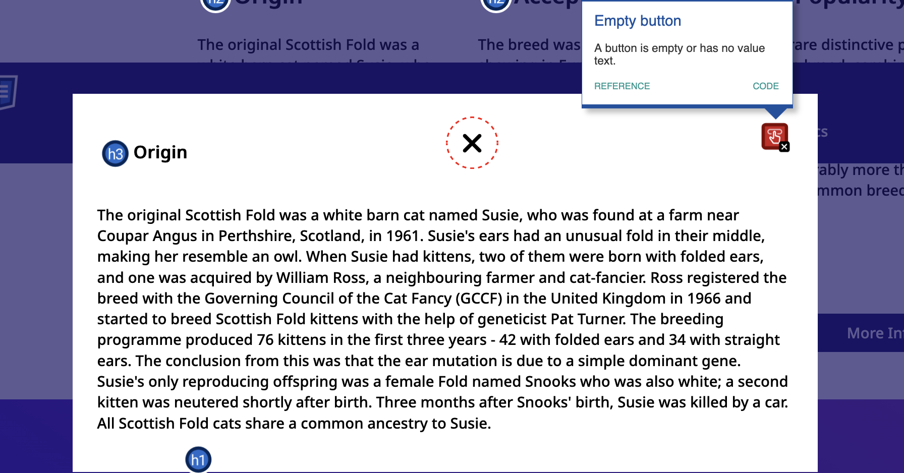
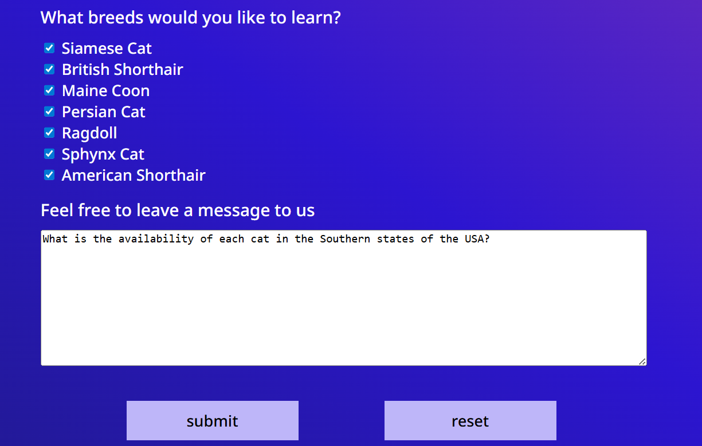
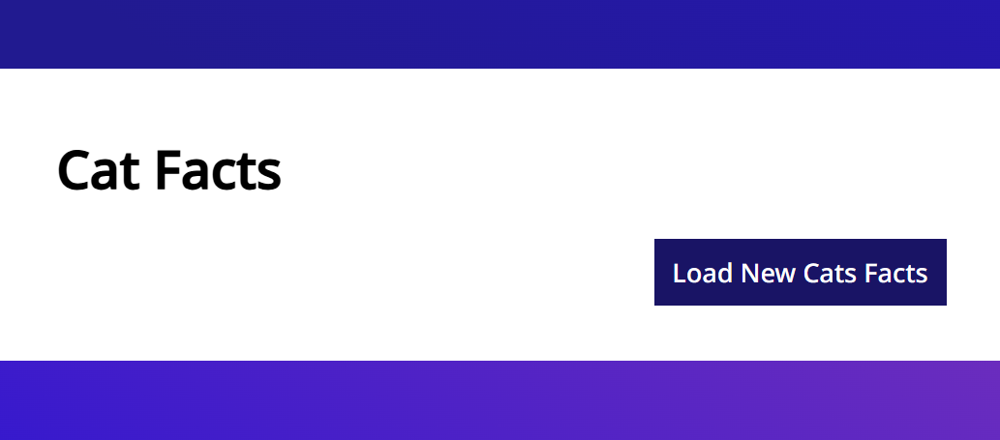

## Code Review Exercise

Write your code review here in markdown format. 
### Issue #1: Accessibility

The issue, why this is an issue, and the solution:

The accessibility issue is the "empty button" issue, meaning that the button is either empty or has no text value text. A button should always have a value, but sometimes, we might use a glyphicon such as "x" to indicate this button is meant to close the modal. To fix this issue, we can add an "aria-label" attribute. It's also a good idea to add the "title" attribute, which will show the "title" of the image as a tooltip when the user hovers over the image.



Initial code:

```html
<button class="close-popup-button">
  <i class="fa-solid fa-xmark"></i>
</button>
```

Updated code:

```html
<button
  class="close-popup-button"
  title="close popup button"
  aria-label="close popup button"
>
  <i class="fa-solid fa-xmark"></i>
</button>
```
### Issue #2: Form Structure

The issue, why this is an issue, and the solution:

The issue is that the Submit and Reset buttons are located outside of the "form" element. When form buttons are placed outside the form, they are not associated with it. As a result, the Submit button will not submit the form data, and the Reset button will not clear the form fields. Form controls should be placed inside the "form" element so they can perform their intended actions.



Initial code:

```html
</form>
<div
  class="form space-evenly-distributed-row-container form-buttons-container"
>
  <input class="form-button" type="submit" value="submit" />
  <input class="form-button" type="reset" value="reset" />
</div>
```

Updated code:

```html
    <div
    class="form space-evenly-distributed-row-container form-buttons-container"
    >
    <input class="form-button" type="submit" value="submit" />
    <input class="form-button" type="reset" value="reset" />
    </div>
</form>
```

### Issue #3: Content Removed Before Data Loads

The issue, why this is an issue, and the solution:

The issue is the "content removed before data loads" issue, meaning that the existing cat facts are removed from the page before the new cat facts have been successfully retrieved from the API. If the request takes time to complete or encounters an error, the user is left with an empty section and no information displayed. Existing content should remain visible until the replacement content is ready. To fix this issue, we can move the replaceChildren() method inside the try block so that the existing cat facts are only removed after the new data has been successfully loaded.



Initial code:

```JavaScript
const fetchCatFacts = async function () {
  const catFactsList = document.getElementById('cat-facts-list');
  catFactsList.replaceChildren();

  createLoadingContainer();

  try {
    const response = await fetch('https://catfact.ninja/facts?limit=10');
    const data = await response.json();

    data.data.forEach((element) => {
      const catFactItem = document.createElement('p');
      catFactItem.setAttribute('class', 'cat-fact-list-item');
      catFactItem.textContent = element.fact;
      catFactsList.append(catFactItem);
    });
  } catch (error) {
    console.error('Error fetching cat facts:', error);
  } finally {
    const loading = document.querySelector('.loading-container');
    loading.setAttribute('class', 'display-none');
  }
};
```

Updated code:

```JavaScript
const fetchCatFacts = async function () {
  const catFactsList = document.getElementById('cat-facts-list');

  createLoadingContainer();

  try {
    const response = await fetch('https://catfact.ninja/facts?limit=10');
    const data = await response.json();

    catFactsList.replaceChildren();

    data.data.forEach((element) => {
      const catFactItem = document.createElement('p');
      catFactItem.setAttribute('class', 'cat-fact-list-item');
      catFactItem.textContent = element.fact;
      catFactsList.append(catFactItem);
    });
  } catch (error) {
    console.error('Error fetching cat facts:', error);
  } finally {
    const loading = document.querySelector('.loading-container');
    loading.setAttribute('class', 'display-none');
  }
};
```